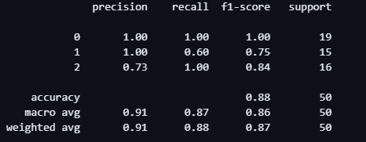
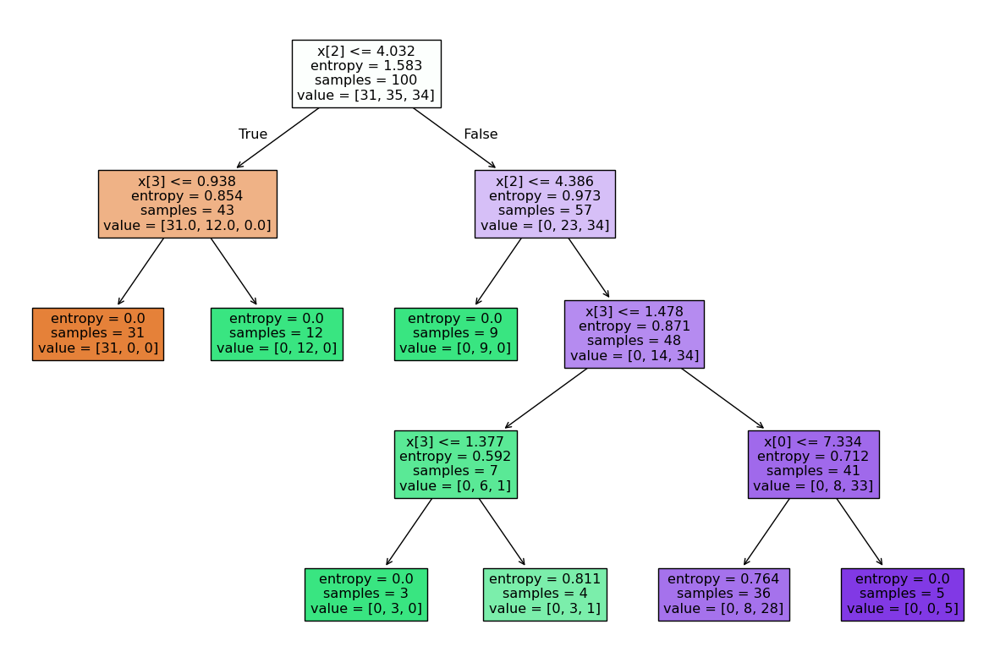
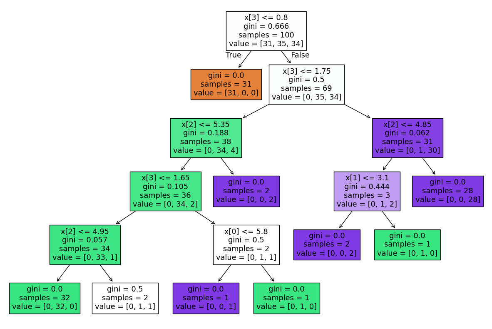

# 🌳 Decision Tree Classification – Pre-Pruning vs Post-Pruning


A machine learning project that compares **Decision Tree Classification using Pre-Pruning and Post-Pruning techniques**, highlighting their impact on model complexity, overfitting, and classification performance.

---

## 📌 Project Overview

This project explores two different pruning strategies in **Decision Tree Classification**:

- **Pre-Pruning:** Restricting tree growth during training  
- **Post-Pruning:** Allowing full growth and pruning the tree afterward  

Both approaches are implemented, evaluated, and visually compared using classification reports and decision tree plots.

---

## 📁 Project Structure

- decission_treepre.ipynb — Decision Tree with pre-pruning  
- decission_treepost.ipynb — Decision Tree with post-pruning  
- pre_pruning_report.png — Classification report (accuracy: 0.88)  
- pre_pruning_tree.png — Pre-pruned decision tree visualization  
- post_pruning_report.png — Classification report (accuracy: 0.98)  
- post_pruning_tree.png — Post-pruned decision tree visualization  
- README.md — Project documentation  

---

## ⚙️ Technologies Used

- Python  
- NumPy  
- Pandas  
- Matplotlib  
- scikit-learn  
- Jupyter Notebook  

---

## 🧠 Model Details

- Algorithm: Decision Tree Classifier  
- Problem Type: Multiclass Classification  
- Splitting Criteria: Entropy (Pre-Pruning), Gini (Post-Pruning)  
- Evaluation Metrics: Precision, Recall, F1-Score, Accuracy  

---

## 📊 Pre-Pruning Results

- Accuracy: 0.88  
- Controlled tree depth during training  
- Reduced model complexity  
- Slight loss in predictive performance  

### Pre-Pruning Classification Report


### Pre-Pruning Tree Visualization


---

## 📊 Post-Pruning Results

- Accuracy: 0.98  
- Tree fully grown before pruning  
- Better generalization and higher accuracy  
- More balanced class predictions  

### Post-Pruning Classification Report


### Post-Pruning Tree Visualization


---

## 🔍 Comparison Summary

| Technique | Accuracy | Tree Complexity | Performance |
|---------|----------|----------------|-------------|
| Pre-Pruning | 0.88 | Lower | Moderate |
| Post-Pruning | 0.98 | Optimized | High |

Post-pruning clearly outperforms pre-pruning by achieving **higher accuracy while maintaining controlled complexity**.

---

## ▶️ How to Run

1. Clone the repository
```text
git clone https://github.com/btboilerplate/Decisiontree_Classicication.git  
```

2. Install required libraries  
```text
pip install numpy pandas matplotlib scikit-learn  
```

3. Open and run notebooks  
- decission_treepre.ipynb  
- decission_treepost.ipynb  

---

## 🧪 Key Observations

- Pre-pruning prevents overfitting but may underfit  
- Post-pruning provides better balance between bias and variance  
- Tree visualizations help interpret decision boundaries  
- Pruning strategy has a major impact on classification performance  

---

## 🚀 Future Improvements

- Add cross-validation comparison  
- Tune pruning hyperparameters automatically  
- Compare with Random Forest and Gradient Boosting  
- Evaluate on larger datasets  

---
